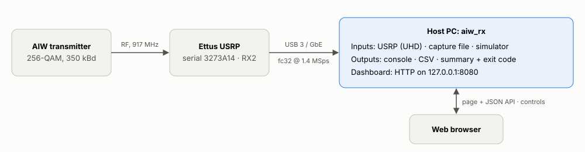
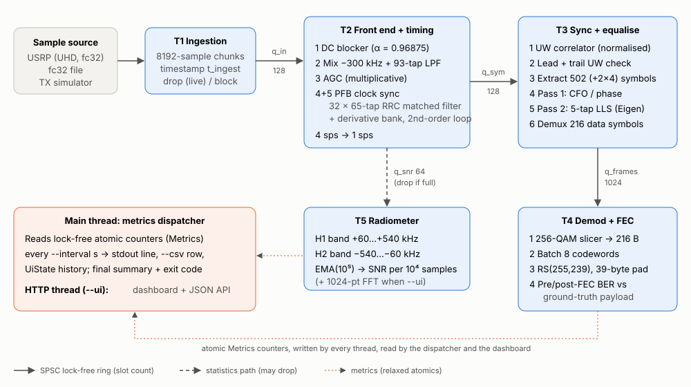

# AIW-Rx Architecture

**Document:** AIW-Rx software architecture

**Applies to:** `aiw_receiver/` on `master` (C++20, CMake)

**Companion documents:** [Installation guide](INSTALLATION.md) · [User manual](USER_MANUAL.md) · [Capella MBSE model](../mbse/README.md)

---

## Contents

1. [Purpose and scope](#1-purpose-and-scope)
2. [System context](#2-system-context)
3. [Architectural overview](#3-architectural-overview)
4. [Concurrency model](#4-concurrency-model)
5. [Data structures and interfaces](#5-data-structures-and-interfaces)
6. [Signal-processing design](#6-signal-processing-design)
7. [Frame synchronisation, equalisation and demultiplexing](#7-frame-synchronisation-equalisation-and-demultiplexing)
8. [Demodulation, FEC and quality measurement](#8-demodulation-fec-and-quality-measurement)
9. [Sample sources](#9-sample-sources)
10. [Metrics, reporting and the dashboard](#10-metrics-reporting-and-the-dashboard)
11. [Performance: throughput, latency and memory](#11-performance-throughput-latency-and-memory)
12. [Error handling and back-pressure](#12-error-handling-and-back-pressure)
13. [Build system and portability](#13-build-system-and-portability)
14. [Verification strategy](#14-verification-strategy)
15. [Design decisions and deviations from the specification](#15-design-decisions-and-deviations-from-the-specification)
16. [Extension points](#16-extension-points)
17. [Known limitations and open items](#17-known-limitations-and-open-items)
18. [Source map](#18-source-map)

---

## 1. Purpose and scope

AIW-Rx is a standalone, real-time software-defined-radio receiver. It replaces the GNU Radio
flowgraph `hwil_conventional_evaluation_rx.grc` with a single native binary that has no GNU Radio
or Python runtime dependency. It receives a 256-QAM, Reed–Solomon-protected, unique-word-framed
burst stream from an Ettus USRP, decodes it, and measures link quality (bit error rate before and
after FEC, SNR, MER) against a known ground-truth payload.

This document describes how the software is structured and why. It is written for engineers who
maintain, verify or extend the receiver. Operating instructions are in the
[User manual](USER_MANUAL.md); build and installation steps are in the
[Installation guide](INSTALLATION.md).

### 1.1 Design goals

| Goal | Target (from the engineering specification) | How it is met |
| --- | --- | --- |
| Throughput | Continuous 1.4 MSps complex float (≈ 11.2 MB/s) | Five-stage pipeline on separate threads; ~10× real-time headroom measured on 4 cores |
| Latency | < 20 ms end to end per frame | 8192-sample chunks (5.85 ms), no locks on the data path; measured mean 6 ms, max 13–16 ms |
| Concurrency | Lock-free producer/consumer pipeline, bounded latency | SPSC ring buffers with pre-allocated slots; bounded queue depths |
| Dependencies | UHD, Eigen 3, a DSP helper, an RS codec | UHD (optional at build time), Eigen 3; DSP and RS implemented natively |
| Hardware independence for test | — (added) | File and simulator sources; full offline test suite |

### 1.2 Terminology

| Term | Meaning |
| --- | --- |
| sps | Samples per symbol (4 at the input, 1 after timing recovery) |
| UW | Unique word: the 143-symbol Zadoff–Chu sequence that brackets every frame |
| Segment | One frame on air: leading UW + 216 data symbols + trailing UW = 502 symbols |
| CFO | Carrier frequency offset remaining after the fixed 300 kHz translation |
| MER | Modulation error ratio, measured on the equalised unique words |
| Pre-/post-FEC BER | Bit error rate of the 216 received bytes before RS decoding / of the 200 payload bytes after it |
| Live source | A source that cannot be paused (the USRP); offline sources are files and the simulator |

---

## 2. System context



External interfaces:

| Interface | Direction | Format | Notes |
| --- | --- | --- | --- |
| USRP via UHD | In | Complex float32 (`fc32`) over `sc16` wire format | Continuous streaming, 8192-sample `recv` calls |
| Capture file | In | Raw interleaved complex float32, 1.4 MSps | Same format as `rx_samples_to_file --type float` or a GNU Radio file sink |
| Console | Out | One status line per interval, final summary | Suppressed with `--quiet` |
| CSV | Out | One row per interval, 20 columns | `--csv PATH` |
| Dashboard | Out/In | HTTP/1.1, HTML page + JSON API | `--ui`; runtime control of frequency/gain or simulator channel |
| Exit code | Out | 0 success, 1 error or failed `--expect-ber0`, 2 bad arguments | Used by CTest and automation |

---

## 3. Architectural overview

The receiver is a **pipeline of five worker threads** joined by **single-producer /
single-consumer (SPSC) lock-free ring buffers**. A sixth, optional thread serves the web
dashboard. The main thread runs the metrics dispatcher.



The code is split into three layers:

| Layer | Contents | Depends on |
| --- | --- | --- |
| **DSP core** (`aiw_core` static library) | Filters, AGC, PFB clock sync, correlator, equaliser, slicer, RS codec, SNR and spectrum estimators, TX simulator, pipeline (`Receiver`), HTTP server, dashboard | Eigen 3, C++20 standard library, OS sockets |
| **Hardware adapter** | `UsrpSource` (header-only, compiled only when UHD is found) | UHD |
| **Application** | `main.cpp`: argument parsing, source selection, dashboard wiring, summary | Both of the above |

Every processing stage is a plain C++ class with a `process()`-style method and no knowledge of
threads. `Receiver` owns the threads and queues and calls the stages. The same stage classes are
driven single-threaded by the test suite, so what is tested is exactly what runs.

---

## 4. Concurrency model

### 4.1 Threads

| Thread | Role | Consumes | Produces | Blocking behaviour |
| --- | --- | --- | --- | --- |
| **T1 Ingestion** | Reads 8192-sample chunks from the source, timestamps them | `SampleSource::read` | `q_in` | Live source: drops a chunk if `q_in` is full. Offline: waits |
| **T2 Front end** | DC block → translate + low-pass → AGC → PFB clock sync | `q_in` | `q_sym`, `q_snr` | `q_snr` never blocks (drops); `q_sym` as T1 |
| **T3 Sync / EQ** | UW correlation, segment extraction, two-pass equaliser, demux | `q_sym` | `q_frames` | As T1 |
| **T4 Demod / FEC** | Slice, batch, RS decode, BER, latency | `q_frames` | Metrics | — |
| **T5 Radiometer** | SNR estimate (+ spectrum when `--ui`) | `q_snr` | Metrics, UiState | — |
| **Main** | Metrics dispatcher, CSV, summary, shutdown | Metrics | stdout, CSV, UiState history | Sleeps 20 ms between checks |
| **HTTP** (optional) | Dashboard page and JSON API | Metrics, UiState | HTTP responses | `select()` with 200 ms timeout |

### 4.2 Queues

All queues are `SpscRing<T>` (`include/circular_buffer.hpp`): a power-of-two array of
pre-allocated slots with an atomic head and tail on separate cache lines. Producers call
`write_slot()`, fill the slot in place and `commit_write()`; consumers call `read_slot()`,
use it in place and `commit_read()`. Large chunk structures are therefore never copied between
threads and never allocated on the data path. Each side caches the other side's index and only
performs an acquire load when the cached value says the ring is full or empty.

| Queue | Element | Slots | Memory | Buffering at 1.4 MSps |
| --- | --- | --- | --- | --- |
| `q_in` | `SampleChunk` (8192 × cf32) | 128 | ≈ 8.4 MB | ≈ 750 ms |
| `q_snr` | `SampleChunk` | 64 | ≈ 4.2 MB | ≈ 375 ms |
| `q_sym` | `SymbolChunk` (≤ 4096 symbols; ≈ 2048 used per input chunk) | 128 | ≈ 4.2 MB | ≈ 750 ms |
| `q_frames` | `Frame` (216 symbols + EQ result) | 1024 | ≈ 1.9 MB | ≈ 1.5 s |

Idle consumers use `Backoff`: 64 spins, then 64 `yield()`s, then 100 µs sleeps. This keeps
latency low under load without consuming a whole core when the input stops.

### 4.3 Shutdown

Stopping is cooperative. The main thread sets `stop` when `--duration` expires or SIGINT/SIGTERM
arrives. T1 then exits its loop and sets `t1_done`. Each downstream thread exits only after its
upstream thread is done **and** its input queue is empty, so every sample already read is fully
processed. T4 flushes a partial FEC batch. The main thread joins all workers, prints the final
report and summary, and (in `--ui` mode, if the input ended by itself) keeps the dashboard up
until Ctrl+C.

### 4.4 Shared state outside the queues

| Object | Written by | Read by | Synchronisation |
| --- | --- | --- | --- |
| `Metrics` | T1–T5 | Main, HTTP | `std::atomic` counters and values, relaxed ordering (statistics only) |
| `UiState` constellation, taps | T3 | HTTP | `std::mutex`; T3 uses `try_lock` and skips the update if busy |
| `UiState` spectrum | T5 | HTTP | As above |
| `UiState` history | Main | HTTP | `std::mutex` (neither thread is on the data path) |
| Simulator channel requests | HTTP | T1 (`TxSimulator::generate`) | Atomics + "pending" flag, applied at the next chunk |
| USRP frequency / gain | HTTP | UHD | UHD `multi_usrp` control calls, safe alongside streaming |

The rule is that **nothing on the data path ever waits for the dashboard**.

---

## 5. Data structures and interfaces

### 5.1 Pipeline records (`include/receiver.hpp`)

```cpp
struct SampleChunk { std::array<cf32, 8192> data; size_t n; Clock::time_point t_ingest; };
struct SymbolChunk { std::array<cf32, 4096> data; size_t n; Clock::time_point t_ingest; };
struct Frame       { EqualizerResult eq; float corr_metric; size_t stream_index;
                     Clock::time_point t_ingest; };
```

`t_ingest` is the time T1 finished reading the chunk. It is carried through every stage so that
T4 can measure per-frame latency.

`EqualizerResult` (`include/equalizer.hpp`) holds the 216 corrected data symbols, the five
equaliser taps, the CFO estimate (rad/symbol), residual phase, UW MER in dB and the condition
number of the regularised normal matrix.

### 5.2 Configuration (`include/config.hpp`)

Compile-time constants mirror section 2 of the specification: sample rate, sps, RRC roll-off,
filter-bank size, RS parameters and frame sizes. All tunable values are in `RxConfig`, which
`main.cpp` fills from the command line. The UW, and with it the segment length, is chosen at run
time.

### 5.3 Sample source interface (`include/sample_source.hpp`)

```cpp
class SampleSource {
  virtual void start(); virtual void stop();
  virtual size_t read(cf32* out, size_t max) = 0;    // 0 = end of stream
  virtual bool is_live() const;                       // true: drop, never block
  virtual size_t overflows() const;
  virtual std::string describe() const = 0, kind() const = 0;
  // Runtime controls; each returns false when not supported
  virtual bool set_center_freq(double), set_gain(double),
               set_sim_esn0(double), set_sim_cfo(double);
  virtual double center_freq() const, gain() const, sim_esn0() const, sim_cfo() const;
};
```

Implementations: `UsrpSource`, `FileSource`, `SimSource` (wrapping `TxSimulator`).

---

## 6. Signal-processing design

The front end (`FrontEnd`, T2) processes each 8192-sample chunk through four stages.

### 6.1 DC blocker (`include/dc_blocker.hpp`)

`y[n] = x[n] − x[n−1] + α·y[n−1]` with `α = 1 − 1/32 = 0.96875`, applied to I and Q. It removes
LO feed-through at 0 Hz, which is 300 kHz away from the wanted signal.

### 6.2 Frequency translation and channel filter (`include/filters.hpp`)

`FreqXlatingFir` mixes by `exp(−j2π·300 kHz·n/Fs)` using a double-precision phasor NCO
(renormalised every 1024 samples), then applies a real low-pass filter:

| Parameter | Value |
| --- | --- |
| Design | Hamming-windowed sinc, unity DC gain |
| Cut-off (−6 dB) | B/2 = 252.07 kHz (B = occupied bandwidth 504.14 kHz) |
| Transition width | 0.1·B = 50.4 kHz |
| Length | 93 taps (N = 3.3·Fs/Δf, forced odd) |
| Measured image rejection | 57.5 dB at −700 kHz |

Filtering uses split real/imaginary accumulators over a reversed-tap buffer so that the compiler
can vectorise it.

### 6.3 Automatic gain control (`include/agc.hpp`)

```
y[n]   = x[n]·g[n]
e[n]   = |y[n]| − 1
g[n+1] = clamp(g[n] − γ·e[n]·g[n], 0, 65536),  γ = attack if e > 0 else decay
```

The update is the one in the specification. The default rates are 10⁻³/10⁻³ instead of the
specification's 0.1/0.001 (see [§15](#15-design-decisions-and-deviations-from-the-specification)).
A floor of 10⁻⁹ stops the multiplicative update from getting stuck at zero.

### 6.4 Polyphase filter-bank clock synchroniser (`src/pfb_clock_sync.cpp`)

This is a port of GNU Radio's `pfb_clock_sync_ccf`, and it also acts as the **matched filter**.

| Parameter | Value |
| --- | --- |
| Prototype | Root-raised cosine, α = 0.35, 16-symbol span, designed at 32 × 4 samples/symbol → 2049 taps |
| Filter bank | 32 branches × 65 taps (the 2049-tap prototype decimated by 32) |
| Derivative bank | `[−1 0 1]` differentiated prototype, normalised so Σ\|d\| = 32 |
| Timing error | `e = ½·(Re y·Re y′ + Im y·Im y′)` |
| Loop | `rate += β·e; k += rate + α·e`, updated 4 times per symbol; `rate` clipped to ±1.5 |
| Gains | `α = 4ζB/(1+2ζB+B²)`, `β = 4B²/(1+2ζB+B²)`, B = 2π/100, ζ = 64 (default) |
| Output | 1 sample per symbol |

`k` is the fractional branch index. When it wraps past 32 (or below 0), the input pointer
advances (or retreats) by one sample. The input buffer keeps two samples of history before the
read pointer so that a negative wrap is always valid.

---

## 7. Frame synchronisation, equalisation and demultiplexing

### 7.1 Frame format

```
 ◀──────────────────────────── segment: 502 symbols ────────────────────────────▶
 ┌──────────────────────┬───────────────────────────────┬──────────────────────┐
 │ UW (143, ZC root 25) │ 216 data symbols = 216 bytes  │ UW (143, ZC root 25) │
 └──────────────────────┴───────────────────────────────┴──────────────────────┘
                          200 payload bytes + 16 RS parity bytes
```

The UW is `u[n] = exp(−jπ·25·n(n+1)/143)`. It is unit-magnitude, and palindromic because the
exponent is symmetric about the centre. Segments are transmitted back to back, so the correlator
sees peaks alternately 359 and 143 symbols apart (spacing 502 per frame).

### 7.2 Correlator and segment extraction (`src/sync_correlator.cpp`)

For each symbol position `n`, with `L = 143`:

```
C[n] = Σ_k s[n+k]·u*[k]          E[n] = Σ_k |s[n+k]|²
m[n] = |C[n]|² / (L·E[n])        ∈ [0, 1],  1 for a noise-free UW at any gain
```

Algorithm:

1. Scan until `m[n] > threshold` (default 0.35).
2. Refine to the local maximum within the next 8 symbols → `n₀`.
3. **Confirm** with the trailing UW: max of `m` over `n₀ + 359 ± 1` must also exceed the
   threshold. The ±1 tolerates a timing-loop slip inside the frame.
4. On success, emit `s[n₀ − 4 … n₀ + 502 + 4)`: the segment plus a 4-symbol margin on each side
   for the equaliser. Resume scanning at `n₀ + 500`, so that a following frame that starts one or
   two symbols early is still found.
5. On failure (a false alarm or a trailing UW mistaken for a leading one), count an unconfirmed
   peak and resume at `n₀ + 1`.

A trailing UW cannot be confirmed as a leading one, because 359 symbols after it lies inside the
next frame's data. The buffer is trimmed once more than 4096 symbols have been consumed.

### 7.3 Two-pass equaliser (`src/equalizer.cpp`)

The flowgraph block `AIW2_combined_correction_two_pass` is implemented as follows. `r[i]` is
the extracted segment, with `i = 0` at the leading UW.

**Pass 1: frequency and phase.** There is no carrier-tracking loop anywhere in the chain, so
residual CFO is removed here, using only the two UWs (`z[k] = r[k]·u*[k]`):

| Estimator | Formula | Unambiguous range |
| --- | --- | --- |
| Coarse | `ω_c = arg Σ z[k+32]·z*[k]` over both UWs ÷ 32 | ±π/32 rad/symbol = ±5.47 kHz |
| Fine | `Δ = arg(C_trail·C_lead*)` after removing `ω_c`, ÷ 359 | ±π/359 rad/symbol = ±487 Hz around `ω_c` |

The segment is then de-rotated by `exp(−j(ω_c + Δ)·i)`. `--no-cfo` skips this pass.

**Pass 2: channel.** A 5-tap linear equaliser is fitted to both UWs:

```
row k:  [ r[k+δ], r[k+δ−1], r[k+δ−2], r[k+δ−3], r[k+δ−4] ]   target u[k]
Y ∈ ℂ^(286×5),  w = (YᴴY + λI)⁻¹ Yᴴd,   λ = 10⁻⁴   (Eigen LDLT)
ŝ[n] = Σ_l w[l]·r[n+δ−l]
```

`δ` is the decision delay (default 2, which centres the taps; 0 is the causal form in the
specification). The residual phase `θ = arg Σ ŝ[k]·u*[k]` over both UWs is removed. MER is
computed on the corrected UWs, and the condition number of `YᴴY + λI` is reported through an
eigenvalue solve.

**Demultiplex.** The 216 corrected data symbols `ŝ[143 … 358]` form the `Frame`.

---

## 8. Demodulation, FEC and quality measurement

### 8.1 256-QAM slicer (`include/constellation.hpp`)

The levels are `{−15, −13, …, 15}` on each axis, with average power 170. The symbol is scaled
by √170, rounded to the nearest odd integer with `2⌊x/2⌋ + 1`, and clamped to ±15. It is then
mapped to `byte = (idx_I << 4) | idx_Q`, where `idx = (level + 15)/2` (natural binary, not
Gray). One symbol gives one byte, so one frame gives 216 bytes.

### 8.2 Reed–Solomon (`src/fec_reed_solomon.cpp`)

| Parameter | Value |
| --- | --- |
| Field | GF(2⁸), primitive polynomial 0x11D, α = 2 |
| Code | RS(255, 239), 16 parity bytes, corrects t = 8 symbol errors |
| Generator | `g(x) = Π_{i=0}^{15} (x − α^(fcr+i))`, fcr = 0 by default (DVB-T / gr-dtv / `reedsolo`) |
| Shortening | 39 leading zero bytes: codeword bytes 39…254 = 200 payload + 16 parity |
| Decoder | Syndromes → Berlekamp–Massey → Chien search → Forney |
| Failure detection | More than 8 errors, root count ≠ locator degree, zero derivative, or a correction inside the 39 padding bytes |

The encoder is systematic (an LFSR), and its parity matches Python `reedsolo` byte for byte;
the tests check this. T4 accumulates `--fec-batch` frames (default 8) before decoding them, as
the specification requires. An uncorrectable codeword passes its systematic bytes through
uncorrected.

### 8.3 BER against ground truth (`include/frame_decoder.hpp`)

At construction, the ground-truth payload (by default the actual output of
`np.random.default_rng(42).integers(0, 256, 200, dtype=np.uint8)`) is RS-encoded once to give the
expected 216-byte codeword. For every frame:

* **Pre-FEC bit errors:** popcount(received ⊕ expected) over 216 bytes (1728 bits).
* **Post-FEC bit errors:** popcount(decoded payload ⊕ ground truth) over 200 bytes (1600 bits).

The first `--warmup-frames` frames (default 16, ≈ 22 ms) are counted separately and left out of
BER, while the AGC and timing loop converge.

### 8.4 Radiometric SNR (`include/snr_estimator.hpp`)

This runs on T5, on the DC-blocked input **before** translation, where the signal occupies
+60…+540 kHz and −540…−60 kHz is empty.

| Step | Implementation |
| --- | --- |
| Band filters | Complex band-pass filters built by modulating a 155-tap Hamming low-pass (240 kHz half-width, 30 kHz transition) to ±300 kHz |
| Evaluation | Every 4th output sample (power averages are unaffected; 4× less CPU) |
| Averaging | Exponential, time constant 10⁵ samples |
| Estimate | `SNR = 10·log10(max(0, P₁ − P₂) / P₂)` |
| Reporting | Mean of the linear ratio over 10⁴-sample blocks |

This measures in-band SNR over 480 kHz, which is `Es/N0 + 10·log10(350/480) ≈ Es/N0 − 1.4 dB`.
The test suite checks the estimator against known Es/N0 to within 1 dB.

---

## 9. Sample sources

| Source | Class | Live? | Controls | Use |
| --- | --- | --- | --- | --- |
| USRP | `UsrpSource` | Yes | Frequency, RF gain | Normal operation |
| File | `FileSource` | No | — | Replaying captures, regression |
| Simulator | `SimSource` + `TxSimulator` | No | Es/N0, CFO | Demonstration, testing without hardware |

### 9.1 USRP adapter (`include/usrp_source.hpp`)

The adapter creates `multi_usrp` from the device arguments, optionally sets the subdevice spec,
then sets rate, frequency, gain and antenna, and waits up to 1 s for the `lo_locked` sensor. It
creates an `fc32`/`sc16` streamer and starts continuous streaming. `read()` loops over `recv()`
until a full 8192-sample chunk is collected. Overflow metadata (`O`) is counted, timeouts are
tolerated, and other errors are logged.

### 9.2 Transmitter simulator (`src/tx_simulator.cpp`)

The simulator is a reference implementation of the transmitter. It builds the frame (UW, the
RS-encoded payload mapped to 256-QAM, UW), shapes it with a 65-tap RRC at 4 sps, and applies
these impairments:

| Impairment | Model |
| --- | --- |
| Sample-clock offset and fractional delay | Cubic Lagrange interpolation at step `1 + ppm·10⁻⁶` |
| Multipath | One-symbol-delayed echo with complex gain |
| AWGN | Complex Gaussian, variance set from Es/N0 referenced to the matched-filter output |
| Carrier | Up-conversion to +300 kHz + CFO |
| DC offset, overall gain | Additive constant, scale 0.05 (exercises the AGC) |

Es/N0 and CFO can be changed while running. The dashboard thread stores the requested values
in atomics, and `generate()` applies them at the start of its next chunk.

---

## 10. Metrics, reporting and the dashboard

### 10.1 Metrics

`Metrics` (`include/metrics.hpp`) is a struct of atomics. Counters only ever increase; the
dispatcher computes per-interval values from differences between reports. Interval maxima
(largest RS correction count per block, maximum latency) are read and reset with `exchange(0)`.

### 10.2 Dispatcher outputs

Every `--interval` seconds, the dispatcher produces:

* **Console:** frames, exact payloads, uncorrectable, RS corrections, pre/post BER, SNR, MER, CFO,
  and mean/max latency, plus drops and overflows when non-zero.
* **CSV:** `time_s, samples, frames, frames_ok, uncorrectable, rs_corrected, rs_max_corrected,
  pre_fec_ber, post_fec_ber, snr_db, uw_mer_db, cfo_hz, corr_metric, eq_cond, agc_gain, pfb_rate,
  latency_mean_ms, latency_max_ms, dropped_chunks, usrp_overflows`.
* **Dashboard history:** one `HistoryPoint` appended to `UiState` (up to 600 points kept).

### 10.3 Dashboard (`--ui`)

```
 Browser ──HTTP──▶ HttpServer (1 thread, select + accept, Connection: close)
                      │
                      ▼
                   Dashboard::handle ──▶ Metrics (atomics), UiState (mutex), SampleSource (controls)
```

* **HTTP server** (`src/http_server.cpp`): about 250 lines over POSIX sockets or Winsock. It
  handles one request per connection, reads at most 64 KiB, uses 2 s receive timeouts, and sends
  `Cache-Control: no-store` and `X-Content-Type-Options: nosniff`.
* **Page:** `web/index.html` is a single page with inline CSS and JavaScript and no external
  resources. CMake converts it into a byte array (`cmake/embed_file.cmake` →
  `dashboard_page.cpp`) whenever the file changes.
* **API:**

  | Method | Path | Returns / accepts |
  | --- | --- | --- |
  | GET | `/` | Dashboard page |
  | GET | `/api/status` | Source, totals, live values, last interval, configuration |
  | GET | `/api/constellation` | Up to 2048 recent equalised symbols, 5 EQ taps |
  | GET | `/api/spectrum` | 1024-bin averaged spectrum (dBFS, −Fs/2…Fs/2) |
  | GET | `/api/history?since=t` | Trend points newer than `t` |
  | POST | `/api/control` | `{"freq":Hz}`, `{"gain":dB}`, `{"esn0":dB}`, `{"cfo":Hz}` |

* **Spectrum:** T5 runs a 1024-point Hann-windowed radix-2 FFT on the first 1024 samples of
  every chunk, averages the results exponentially (factor 0.1), and publishes every 8th chunk
  (about 20 updates per second). The display is tone-calibrated: a complex tone of amplitude A
  reads 20·log10(A) dBFS.
* **JSON:** a small writer that emits `null` for non-finite values. It checks the IEEE exponent
  bits directly, because `-ffast-math` lets the compiler assume `isfinite()` is always true.
* **Security:**
  * The server binds to 127.0.0.1 by default.
  * `POST` requires the header `X-AIW-Control: 1`. A page on another site cannot send a custom
    header without a CORS preflight, and the server never grants one, so this blocks cross-site
    requests.
  * With the loopback binding, the `Host` header must start with `localhost` or `127.0.0.1`. This
    guards against DNS rebinding.
  * Controls are range-checked: frequency 70 MHz–6 GHz, gain 0–89 dB, Es/N0 0–300 dB, CFO ±20 kHz.
  * `--ui-bind 0.0.0.0` exposes the dashboard with no authentication, and the documentation
    says so.

---

## 11. Performance: throughput, latency and memory

### 11.1 Throughput

Measured on a 4-core cloud VM (portable x86-64 build, no `-march=native`), 20 s of simulated
signal is processed in 2.1 s of wall time, simulator included. That is about 10× real time.
The main per-sample costs are:

| Stage | Cost per input sample (approx.) |
| --- | --- |
| Channel filter | 93 real × complex MACs |
| PFB | 2 × 65 MACs per output symbol → ≈ 33 per input sample |
| SNR band filters | 2 × 155 complex MACs ÷ 4 (decimated) ≈ 78 |
| Correlator | 143 complex MACs per symbol → ≈ 36 per input sample |
| Equaliser, RS | Per frame; negligible (~700 frames/s) |

### 11.2 Latency

Latency is measured per frame, from `t_ingest` of the chunk that completes the segment to the
end of its RS decode.

| Condition | Mean | Max |
| --- | --- | --- |
| Linux, `--realtime` simulation, FEC batch 8 | 6.0 ms | 13–16 ms |
| Windows build under Wine | 6.2 ms | 21 ms |

This does not include the time the radio takes to fill a chunk (up to 5.85 ms). Batching eight
codewords adds up to about 11 ms for the first frame of a batch; `--fec-batch 1` removes that.

### 11.3 Memory

About 19 MB of ring buffers ([§4.2](#42-queues)), plus about 2 MB of working buffers and the page.
Nothing on the data path allocates after the first few chunks. The only exceptions are the
`std::vector` buffers inside the correlator and PFB, which reuse their capacity.

---

## 12. Error handling and back-pressure

| Condition | Behaviour | Visible as |
| --- | --- | --- |
| USRP overflow (host too slow) | UHD reports `O`; samples are lost in the transport | `USRP overflows` counter, `O` in the console |
| Pipeline slower than a live source | T1/T2/T3 drop whole chunks/frames rather than block | `DROPPED` in the console, `dropped_chunks` in CSV |
| SNR thread behind | Its copy is dropped; data path unaffected | Dropped internally, SNR updates less often |
| False correlation peak | Rejected by the trailing-UW check | `unconfirmed_peaks` in `/api/status` |
| Equaliser failure (non-finite solution) | Frame discarded | `eq_failures` in `/api/status` |
| More than 8 byte errors | Frame counted uncorrectable, payload passed through | `unc` / `uncorrectable` |
| Bad command-line value | Message on stderr, exit code 1 (2 for unknown options) | — |
| Dashboard port in use | Startup error naming the port | — |
| No USRP found | UHD's "No devices found" error, exit code 1 | — |

---

## 13. Build system and portability

* **CMake ≥ 3.20, C++20.**

  | Target | What it is |
  | --- | --- |
  | `aiw_core` | Static library with everything except `main.cpp` |
  | `aiw_rx` | The receiver |
  | `aiw_tests` | The test executable |

* **Options:**

  | Option | Effect |
  | --- | --- |
  | `AIW_NATIVE` | `-march=native` (GCC/Clang) or `/arch:AVX2` (MSVC) |
  | `AIW_FAST_MATH` | `-ffast-math` or `/fp:fast` |
  | `AIW_REQUIRE_UHD` | Fail configuration if UHD is missing |
  | `AIW_BUILD_TESTS` | Build the tests |

* **UHD is optional.** Without it, `AIW_HAVE_UHD` is undefined, `UsrpSource` compiles away, and
  `--source usrp` gives a clear error.
* **Platforms:**

  | Platform | Toolchain | Status |
  | --- | --- | --- |
  | Ubuntu 24.04 x86-64 | GCC 13 | Built and tested, with UHD 4.6 and without |
  | Windows x86-64 | MinGW-w64 GCC 13, cross-compiled | Built and tested under Wine, statically linked; no UHD |
  | Windows x86-64 | MSVC 2022 + UHD | Supported by the build files (flag set, `std::popcount`); **untested** |

* **Page embedding** is done with a CMake script rather than a C++ raw-string literal, because
  MSVC limits the length of string literals.

---

## 14. Verification strategy

| Level | What | Where |
| --- | --- | --- |
| Unit | UW = ZC(143, 25); golden payload bytes; slicer and nearest-odd rounding; RS correction of 0–8 errors and detection of 9 (fcr 0 and 1), `reedsolo` parity; SPSC ordering under two threads; DC blocker, AGC; translation filter image rejection; FFT bin and level; dashboard routing and security guards | `tests/test_main.cpp` |
| Component | Equaliser on a synthetic 3-tap channel with 200 Hz CFO (causal vs centred); radiometer against known Es/N0 | `tests/test_main.cpp` |
| Loopback | Full DSP chain driven single-threaded from the simulator: clean channel; 38 dB + 400 Hz + 10 ppm + echo (BER 0, < 8 corrections/block, segment spacing checked every frame); 29 dB (RS actively correcting) | `tests/test_main.cpp` |
| System | `aiw_rx --source sim --expect-ber0` through the real threaded pipeline | CTest `rx_sim_end_to_end` |
| UI | Headless Chromium (Playwright): layout at 1440 px and 390 px, both colour schemes, tooltips, controls, no JS errors | Manual, recorded in the PR |
| Hardware | UHD ingestion without overflow; retuning; zero BER on the lab link | **Outstanding:** requires the USRP |

Mapping to the specification's verification gates (§9 of the spec):

| Gate | Evidence |
| --- | --- |
| 1 UHD ingestion without drops | Overflow and drop counters in every report; hardware run outstanding |
| 2 DC notch and translation | Unit tests: constant input removed; +300 kHz tone at DC; 57.5 dB image rejection |
| 3 1 sample/symbol, open eye | Symbol/sample ratio 0.2500; MER 41 dB on a clean channel; constellation view |
| 4 UW peaks at segment spacing | Spacing asserted on every frame in the loopback tests |
| 5 LLS conditioning | Condition number ≈ 1.4–1.9 reported per frame; MER 36 dB at Es/N0 38 dB with echo |
| 6 RS decoding, BER = 0 | Zero post-FEC BER in the impaired loopback; 1.8·10⁻³ → 0 at 29 dB |

---

## 15. Design decisions and deviations from the specification

| # | Specification says | Implementation | Reason | Revert with |
| --- | --- | --- | --- | --- |
| D1 | UW length 136 | 143 (the table given) | The table has 143 entries and is exactly ZC(143, 25); geometry derived from the UW | `--uw-zc 136:<root>` |
| D2 | Golden payload hex table | Real NumPy seed-42 output | The printed table does not match the stated NumPy expression | `--golden spec` |
| D3 | Round with `2⌊(x+1)/2⌋−1` | `2⌊x/2⌋+1` | The printed formula does not round to the nearest odd level | — |
| D4 | Matched filter then PFB | PFB is the matched filter | Two RRC filters would give a raised-cosine² pulse with ISI | — |
| D5 | AGC attack 0.1, decay 0.001 | 10⁻³ / 10⁻³ | Spec rates modulate gain within a frame: MER capped at ~23 dB, every frame uncorrectable | `--agc-attack 0.1 --agc-decay 0.001` |
| D6 | PFB damping 0.707 | 64 (= 2·nfilts) | Matches GNU Radio's internal value; ~5× faster convergence | `--damping 0.707` |
| D7 | Causal equaliser | Decision delay 2 (centred) | A causal filter cannot remove pre-cursor ISI (18.8 vs 48.5 dB MER on a test channel) | `--eq-delay 0` |
| D8 | Phase correction only | UW-aided CFO + phase | No carrier loop exists anywhere in the chain | `--no-cfo` |
| D9 | Subdev `"0:A"` | Device default | Not valid UHD syntax | `--subdev A:A` |
| D10 | — | 16 warm-up frames excluded from BER | Start-up transient is not link quality | `--warmup-frames 0` |
| D11 | Liquid-dsp or libfec | Native DSP and RS | Fewer dependencies; RS verified against `reedsolo` | — |

---

## 16. Extension points

| To add… | Change |
| --- | --- |
| A new input (e.g. SoapySDR, network stream) | Implement `SampleSource`; add a `--source` branch in `main.cpp` |
| A different UW or frame length | UW via `--uw-zc` or `make_zadoff_chu`; `DATA_LENGTH_SYM` is compile-time because it equals the RS codeword size |
| Gray-coded or different QAM | `include/constellation.hpp` (`map`/`slice`) |
| Soft-decision / other FEC | Replace `FrameDecoder`; T4 is the only consumer |
| New metric | Add an atomic to `Metrics`, write it in the owning thread, add it to the report, CSV and `/api/status` |
| New dashboard panel | Add data to `UiState` (publish with `try_lock`), an endpoint in `Dashboard`, and a panel in `web/index.html` |
| Real-time scheduling / CPU pinning | Thread creation is in `Receiver::run` |

---

## 17. Known limitations and open items

1. **Not yet run against the USRP.** Ingestion without overflow, LO lock handling, retuning from
   the dashboard and zero BER on the real link are unverified.
2. **The UW length is unresolved.** If the transmitter uses a 136-symbol UW, run with
   `--uw-zc 136:<root>`; the frame then becomes 488 symbols.
3. **No USRP support in the prebuilt Windows binary.** The MSVC + UHD route is documented but
   untested.
4. **Sample rate is fixed by design.** `--rate` changes the USRP rate, but the filters are
   designed for 1.4 MSps and 4 sps (a warning is printed).
5. **Latency under Wine** peaked at 21 ms against the 20 ms target. Native Windows latency has
   not been measured.
6. **The dashboard has no authentication.** Keep the default loopback binding unless the network
   is trusted.
7. **CFO range is ±5.47 kHz.** Larger offsets (about 6 ppm at 917 MHz) need an external
   reference or a coarse acquisition stage.

---

## 18. Source map

| Path | Responsibility |
| --- | --- |
| `include/config.hpp` | Constants and `RxConfig` |
| `include/circular_buffer.hpp` | `SpscRing`, `Backoff` |
| `include/dc_blocker.hpp`, `include/agc.hpp` | DC notch, AGC |
| `include/filters.hpp` | FIR design (low-pass, band-pass, RRC), `FirFilter`, `Rotator`, `FreqXlatingFir` |
| `include/front_end.hpp` | T2 stage chain |
| `include/pfb_clock_sync.hpp`, `src/pfb_clock_sync.cpp` | Timing recovery / matched filter |
| `include/unique_word.hpp` | UW table, Zadoff–Chu generator |
| `include/sync_correlator.hpp`, `src/sync_correlator.cpp` | Correlator, segment extraction |
| `include/equalizer.hpp`, `src/equalizer.cpp` | Two-pass equaliser |
| `include/constellation.hpp` | 256-QAM map and slice |
| `include/fec_reed_solomon.hpp`, `src/fec_reed_solomon.cpp` | RS(255, 239) codec |
| `include/frame_decoder.hpp` | T4 per-frame decode and BER |
| `include/golden_payload.hpp`, `tools/gen_golden_payload.py` | Ground truth |
| `include/snr_estimator.hpp`, `include/spectrum.hpp` | Radiometer, FFT spectrum |
| `include/sample_source.hpp`, `include/usrp_source.hpp` | Sources |
| `include/tx_simulator.hpp`, `src/tx_simulator.cpp` | Transmitter and channel model |
| `include/metrics.hpp`, `include/ui_state.hpp` | Shared statistics and dashboard data |
| `include/receiver.hpp`, `src/receiver.cpp` | Threads, queues, dispatcher |
| `include/http_server.hpp`, `src/http_server.cpp` | HTTP server |
| `include/dashboard.hpp`, `src/dashboard.cpp`, `web/index.html` | Dashboard |
| `src/main.cpp` | Command line and wiring |
| `tests/test_main.cpp` | Test suite |
| `cmake/mingw-w64-x86_64.cmake`, `cmake/embed_file.cmake` | Cross-compile toolchain, page embedding |
