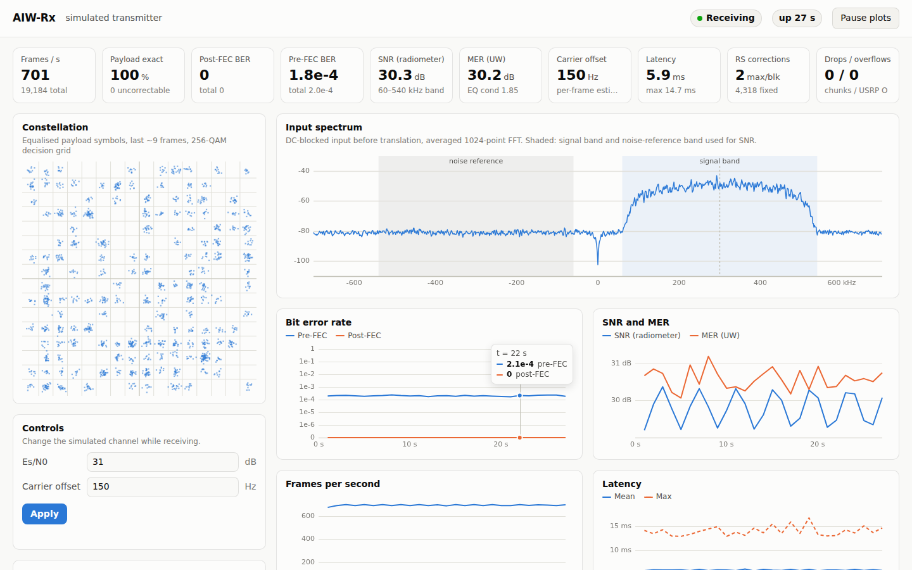

# AIW-Rx User Manual

**Applies to:** `aiw_receiver/` on `master`

**Companion documents:** [Installation guide](INSTALLATION.md) · [Architecture](ARCHITECTURE.md)

---

## Contents

1. [Introduction](#1-introduction)
2. [Quick start](#2-quick-start)
3. [What the receiver measures](#3-what-the-receiver-measures)
4. [Command-line reference](#4-command-line-reference)
5. [Operating modes](#5-operating-modes)
6. [Reading the console output](#6-reading-the-console-output)
7. [CSV logging](#7-csv-logging)
8. [The dashboard](#8-the-dashboard)
9. [Common procedures](#9-common-procedures)
10. [Troubleshooting](#10-troubleshooting)
11. [Advanced tuning](#11-advanced-tuning)
12. [Reference data](#12-reference-data)

---

## 1. Introduction

AIW-Rx (`aiw_rx`) receives the AIW 256-QAM test signal from an Ettus USRP (the reference radio is a
**USRP B210 on USB 3.0**), decodes it, and
reports link quality in real time. Every frame carries the same known 200-byte payload, so the
receiver can count exactly how many bits arrive wrong, both before and after Reed–Solomon error
correction.

It can take its input from:

* **a USRP**: live reception, the normal mode;
* **a capture file**: replaying samples recorded earlier;
* **the built-in simulator**: a software transmitter and channel, for training, demonstration
  and testing without hardware.

Results appear as one status line per second in the terminal, optionally as a CSV file, and
optionally as a live dashboard in a web browser.

This manual assumes `aiw_rx` is installed and on your `PATH`. If it is not, see the
[Installation guide](INSTALLATION.md), or prefix commands with the path to the binary (for example
`./bin/aiw_rx`, or `bin\aiw_rx.exe` on Windows).

---

## 2. Quick start

**Try it without a radio:**

```sh
aiw_rx --source sim --ui
```

Open <http://localhost:8080>. The dashboard should show **Receiving** at about 700 frames per
second with a post-FEC BER of 0. Press **Ctrl+C** in the terminal to stop.

**Receive from the USRP B210** (set up as in [Installation §E](INSTALLATION.md#e-set-up-the-usrp-b210-usb); transmitter
on; RF A / RX2, 917 MHz, default gain 45 dB):

```sh
aiw_rx --ui
```

**Receive at another frequency and gain, logging to a file, for ten minutes:**

```sh
aiw_rx --freq 915e6 --gain 40 --csv run.csv --duration 600
```

---

## 3. What the receiver measures

| Measurement | Meaning | Good value |
| --- | --- | --- |
| **Frames/s** | Frames found and decoded per second. The transmitter sends ~697 frames/s | ≈ 697 |
| **Payload exact** | Share of frames whose 200-byte payload decoded with no bit errors | 100 % |
| **Post-FEC BER** | Bit error rate of the payload after RS correction | 0 |
| **Pre-FEC BER** | Bit error rate of the received bytes before RS correction | Below about 10⁻³ leaves RS comfortable headroom |
| **Uncorrectable** | Frames with more than 8 byte errors, which RS cannot fix | 0 |
| **RS corrections (max/blk)** | Largest number of bytes RS had to fix in one frame. RS fixes at most 8 | Well below 8 |
| **SNR** | Radiometric in-band signal-to-noise ratio, from spectrum power | 256-QAM needs roughly ≥ 27 dB |
| **MER** | Modulation error ratio on the equalised unique words: how tight the constellation is | ≥ 28 dB for reliable 256-QAM |
| **Carrier offset (CFO)** | Frequency error between transmitter and receiver, estimated per frame | Within ±5 kHz (the correction range) |
| **Latency** | Time from sample arrival to decoded frame | Mean ≈ 6 ms, max < 20 ms |
| **Drops / overflows** | Samples lost because the computer could not keep up | 0 / 0 |

**Warm-up:** the first 16 frames after starting (about 22 ms) are decoded but not counted in
the BER figures, while the gain control and timing recovery settle. The summary lists them as
"warm-up frames".

---

## 4. Command-line reference

`aiw_rx [options]`. Options take one value unless marked *(flag)*. Frequencies are in Hz, and
`917e6` notation is accepted.

### 4.1 Source selection

| Option | Default | Description |
| --- | --- | --- |
| `--source S` | `usrp` (or `sim` if built without UHD) | Input: `usrp`, `file` or `sim` |
| `--file PATH` | — | Capture file for `--source file`: raw interleaved complex float32 at 1.4 MSps |
| `--loop` *(flag)* | off | Replay the capture file endlessly |
| `--realtime` *(flag)* | off | Pace file/simulator input at the real sample rate (needed for meaningful latency figures) |

### 4.2 Radio

| Option | Default | Description |
| --- | --- | --- |
| `--args STR` | `serial=3273A14` | UHD device arguments. B210: `serial=<serial>` or `type=b200,serial=<serial>`; Ethernet USRPs: `addr=192.168.10.2` |
| `--subdev STR` | device default | RX subdevice spec. B210: `A:A` = RF A (the default), `A:B` = RF B |
| `--antenna STR` | `RX2` | RX antenna port. B210: `RX2` or `TX/RX` |
| `--freq HZ` | `917e6` | RF centre frequency (B210: 70 MHz – 6 GHz) |
| `--gain DB` | `45` | RF gain. **B210 receive range: 0–76 dB**; higher values are clipped to 76 by UHD |
| `--rate SPS` | `1.4e6` | Sample rate. **Leave at 1.4e6:** the filters are designed for it |

### 4.3 Receiver processing

| Option | Default | Description |
| --- | --- | --- |
| `--xlat-offset HZ` | `300000` | Offset of the signal from the tuned frequency |
| `--agc-attack X` | `1e-3` | AGC rate when the level is too high (the spec value 0.1 is too fast for 256-QAM; see §11) |
| `--agc-decay X` | `1e-3` | AGC rate when the level is too low |
| `--loop-bw X` | `0.0628` (2π/100) | Timing-recovery loop bandwidth |
| `--damping X` | `64` | Timing-recovery damping (GNU Radio's value; the spec says 0.707) |
| `--corr-threshold X` | `0.35` | Frame-detection threshold, 0–1 (normalised correlation) |
| `--eq-delay N` | `2` | Equaliser decision delay, 0–4 (0 = causal form in the spec) |
| `--eq-lambda X` | `1e-4` | Equaliser regularisation |
| `--no-cfo` *(flag)* | off | Disable carrier-offset correction |
| `--uw-zc N:ROOT` | spec table (143, 25) | Use a Zadoff–Chu unique word of length N and root ROOT |
| `--fec-batch N` | `8` | Codewords collected before decoding (1 = lowest latency) |
| `--rs-fcr N` | `0` | Reed–Solomon first consecutive root |
| `--warmup-frames N` | `16` | Frames excluded from BER at start-up |
| `--golden numpy\|spec` | `numpy` | Ground-truth payload table |
| `--golden-file PATH` | — | Ground-truth payload from a 200-byte binary file |

### 4.4 Simulator (`--source sim`)

| Option | Default | Description |
| --- | --- | --- |
| `--sim-esn0 DB` | `40` | Signal-to-noise ratio Es/N0. 200 or more means no noise |
| `--sim-cfo HZ` | `150` | Carrier frequency offset |
| `--sim-ppm X` | `5` | Sample-clock offset in parts per million |
| `--sim-echo RE,IM` | `0.15,0.1` | Complex gain of a one-symbol-delayed echo (multipath). `0,0` disables it |
| `--sim-seconds S` | `5` (endless with `--ui`) | Amount of signal to generate; `0` = endless |

### 4.5 Dashboard

| Option | Default | Description |
| --- | --- | --- |
| `--ui` *(flag)* | off | Serve the dashboard. With `--source sim` this also implies `--realtime` and endless running |
| `--ui-port N` | `8080` | Port to listen on |
| `--ui-bind ADDR` | `127.0.0.1` | Address to listen on. `0.0.0.0` makes the dashboard reachable from other computers, **with no password** |

### 4.6 Run control and output

| Option | Default | Description |
| --- | --- | --- |
| `--duration S` | until input ends or Ctrl+C | Stop after S seconds |
| `--interval S` | `1` | Seconds between status lines, CSV rows and dashboard trend points |
| `--csv PATH` | — | Write one CSV row per interval (the file is overwritten) |
| `--expect-ber0` *(flag)* | off | Exit with code 1 unless frames were decoded and post-FEC BER is 0 |
| `--quiet` *(flag)* | off | No per-interval lines (the summary is still printed) |
| `--help` | — | Print the option list |

### 4.7 Exit codes

| Code | Meaning |
| --- | --- |
| 0 | Normal end (and, with `--expect-ber0`, error-free) |
| 1 | Runtime error (e.g. no USRP found, file missing, port in use) or `--expect-ber0` failed |
| 2 | Unknown or incomplete command-line option |

---

## 5. Operating modes

### 5.1 Live reception from the USRP B210

The reference radio is an Ettus **USRP B210** on **USB 3.0**. The
[Installation guide](INSTALLATION.md#e-set-up-the-usrp-b210-usb) covers first-time setup
(images, USB permissions, driver, probe). Before each session:

1. Connect the signal to **RF A → RX2**, with an attenuator for cabled tests.
2. Connect USB 3.0 straight to the PC, and preferably the 6 V adapter.
3. Check that `uhd_find_devices` lists `product: B210`.

Then:

```sh
aiw_rx                                                  # B210 serial 3273A14, RF A / RX2, 917 MHz, 45 dB
aiw_rx --args "serial=31AB123" --freq 915e6 --gain 38   # a different B210
aiw_rx --args "type=b200" --ui                          # the only B2xx plugged in, with the dashboard
aiw_rx --subdev A:B                                     # use RF B instead of RF A
aiw_rx --antenna TX/RX                                  # receive on the TX/RX port of RF A
```

| B210 setting | Value used by aiw_rx | Notes |
| --- | --- | --- |
| Channel / port | RF A (`A:A`), RX2 | `--subdev A:B` for RF B; `--antenna TX/RX` for the other port |
| Sample rate | 1.4 MSps | UHD chooses the master clock itself (`Asking for clock rate … MHz`). `aiw_rx` warns if the actual rate differs |
| Frequency | 917 MHz | B210 range 70 MHz – 6 GHz |
| RF gain | 45 dB | B210 receive range 0–76 dB. The dashboard accepts up to 89 dB (the specification's range), but UHD clips to 76 dB, and the header shows the actual gain |
| Wire format | `sc16` over USB, delivered as complex float32 | About 5.6 MB/s at 1.4 MSps |

A normal start-up looks like this (UHD's own lines are abbreviated):

```
[INFO] [B200] Detected Device: B210
[INFO] [B200] Operating over USB 3.
[INFO] [B200] Asking for clock rate … MHz...
[usrp] Single USRP: Device: B-Series Device  Mboard 0: B210 ...
[usrp] rate 1.4 MSps, freq 917 MHz, gain 45 dB, antenna RX2
[usrp] LO locked
[aiw_rx] source: usrp:serial=3273A14  UW length 143, segment 502 symbols
```

Streaming runs until you press Ctrl+C or `--duration` expires. If a queue fills because the
computer can't keep up, whole chunks are dropped and counted (`DROPPED`), so the receiver never
falls progressively behind the radio. Overflows inside UHD or on USB show as `O`. With `--ui`,
the dashboard's **Controls** retune the B210's frequency and gain while it receives.

### 5.2 Recording and replaying captures

Record 10 seconds with UHD's example tool. `--type float` gives the complex-float32 format that
AIW-Rx expects:

```sh
/usr/libexec/uhd/examples/rx_samples_to_file --args "type=b200,serial=3273A14" --freq 917e6 \
    --rate 1.4e6 --gain 45 --ant RX2 --type float --duration 10 --file capture.fc32
```

Replay it:

```sh
aiw_rx --source file --file capture.fc32                  # as fast as possible
aiw_rx --source file --file capture.fc32 --realtime --ui  # at real speed, with the dashboard
aiw_rx --source file --file capture.fc32 --loop --ui      # endlessly
```

A GNU Radio *File Sink* of type *complex* at 1.4 MSps also works. The capture must be taken at
1.4 MSps with the signal 300 kHz above the tuned frequency, the same way the receiver tunes.

### 5.3 Simulator

The simulator generates exactly what the transmitter sends, then adds noise, a frequency offset,
clock drift, an echo, a DC offset and a gain change:

```sh
aiw_rx --source sim                                     # 5 s at default impairments
aiw_rx --source sim --sim-esn0 28 --sim-cfo 800 --ui    # harsher channel, live view
aiw_rx --source sim --sim-esn0 300 --sim-echo 0,0 --sim-cfo 0 --sim-ppm 0   # perfect channel
```

Without `--realtime` or `--ui`, it runs as fast as the computer allows (about 10× real time).

---

## 6. Reading the console output

Start-up:

```
[aiw_rx] source: usrp:serial=3273A14  UW length 143, segment 502 symbols
[aiw_rx] dashboard: http://127.0.0.1:8080/
```

One line per interval:

```
[   2.01 s] frames  696 ok  696 unc 0 | RS fixed 38 (max 2/blk) | BER pre 3.99e-05 post 0.00e+00 | SNR 30.9 dB MER 31.7 dB CFO 150 Hz | lat 6.0/13.4 ms
```

| Field | Meaning (for this interval) |
| --- | --- |
| `[2.01 s]` | Time since start |
| `frames 696` | Frames decoded |
| `ok 696` | Frames whose payload was exactly right after FEC |
| `unc 0` | Frames RS could not correct |
| `RS fixed 38 (max 2/blk)` | Bytes corrected in total, and the most in any one frame |
| `BER pre … post …` | Bit error rate before and after RS |
| `SNR`, `MER`, `CFO` | Latest radiometric SNR, UW MER and carrier-offset estimate |
| `lat 6.0/13.4 ms` | Mean and maximum frame latency |
| `DROPPED n` | Appears only if chunks or frames were dropped (cumulative) |
| `O n` | Appears only if the USRP reported overflows (cumulative) |

At the end:

```
=== AIW-Rx summary ===
samples            8400000
warm-up frames     16 (excluded from BER)
frames decoded     4167
payload exact      4167
uncorrectable      0
max RS corrections 2 per block
pre-FEC BER        4.45798e-05
post-FEC BER       0
radiometric SNR    30.9208 dB
UW MER             31.4129 dB
latency mean/max   5.96126 / 16.0522 ms
dropped chunks     0
USRP overflows     0
```

`nan` means no value was available yet, for example BER when no frame has been decoded.

---

## 7. CSV logging

`--csv run.csv` writes a header and then one row per interval in which at least one frame was
decoded. It opens directly in Excel, LibreOffice or pandas.

| Column | Unit | Meaning |
| --- | --- | --- |
| `time_s` | s | Time since start |
| `samples` | — | Samples received so far (cumulative) |
| `frames` | — | Frames decoded in the interval |
| `frames_ok` | — | Frames with an exact payload |
| `uncorrectable` | — | Frames RS could not correct |
| `rs_corrected` | bytes | Bytes corrected by RS |
| `rs_max_corrected` | bytes | Most bytes corrected in one frame |
| `pre_fec_ber` | — | BER before RS |
| `post_fec_ber` | — | BER after RS |
| `snr_db` | dB | Radiometric SNR |
| `uw_mer_db` | dB | MER on the unique words |
| `cfo_hz` | Hz | Carrier-offset estimate |
| `corr_metric` | 0–1 | Strength of the latest frame-sync correlation peak (1 = perfect) |
| `eq_cond` | — | Condition number of the equaliser fit (≈ 1–3 is healthy) |
| `agc_gain` | — | Current AGC gain (linear) |
| `pfb_rate` | — | Timing-loop rate estimate (tracks sample-clock offset) |
| `latency_mean_ms`, `latency_max_ms` | ms | Frame latency |
| `dropped_chunks` | — | Chunks/frames dropped (cumulative) |
| `usrp_overflows` | — | USRP overflow events (cumulative) |

Example, plotting BER over a run in Python:

```python
import pandas as pd
d = pd.read_csv("run.csv")
d.plot(x="time_s", y=["pre_fec_ber", "post_fec_ber"], logy=True)
```

---

## 8. The dashboard

Start any mode with `--ui` and open <http://localhost:8080> (or the port given with `--ui-port`).
The page updates by itself about once a second; the constellation and spectrum update more often.



### 8.1 Header

* **Source**: what the receiver is reading, plus the frequency and gain when it is a USRP.
* **Status pill**:

  | Pill | Meaning |
  | --- | --- |
  | 🟢 **Receiving** | Frames are arriving and all were corrected |
  | 🟡 **Receiving with errors** | Frames are arriving but some were uncorrectable |
  | 🟡 **Searching for frames** | No frames found in the last interval |
  | **Run finished** | The file or finite simulation has ended; figures are frozen |
  | 🔴 **Disconnected** | The browser cannot reach `aiw_rx` (it stopped or the network dropped) |

* **Uptime**, and **Pause plots**, which freezes the charts so you can study them while the
  receiver carries on.

### 8.2 Stat tiles

The ten tiles show the measurements from [§3](#3-what-the-receiver-measures). The large number is
the latest interval, and the small line underneath is the running total or extra detail (for
example "total 2.1e-2", or the equaliser condition number under MER).

### 8.3 Constellation

This shows the last ~2000 received data symbols after equalisation, drawn over the 256-QAM
decision grid.

* **Healthy:** tight dots, each in the centre of its grid cell.
* **Fuzzy clouds reaching the cell edges:** low SNR. Expect pre-FEC errors.
* **A rotating or ring-shaped pattern:** a carrier offset beyond the correction range, or no
  frame lock.
* **Squashed or stretched grid:** gain compression or IQ imbalance in the front end.

Hover over the plot to see which symbol (byte value and I/Q levels) the cursor position decodes
to.

### 8.4 Input spectrum

This is the spectrum of the received signal before translation, in dBFS (0 dBFS = a full-scale
tone). The signal should fill the shaded **signal band** (+60 to +540 kHz, centred on the dashed
+300 kHz marker). The shaded **noise reference** band should hold only the noise floor, because
the SNR estimate compares the two. Hover to read the level and frequency offset (plus the absolute RF frequency when the source is a USRP).

A notch at 0 kHz is the DC blocker at work, and is normal. Energy in the noise-reference band
from another transmitter makes the SNR reading too low.

### 8.5 Trends

Four charts cover the last 5 minutes: **bit error rate** (log scale; the bottom line is zero
errors), **SNR and MER**, **frames per second** and **latency** (mean solid, max dashed). Hover
for exact values at any time. **Table view** under the charts lists the last 60 intervals as
numbers.

### 8.6 Controls

| Source | Controls | Effect |
| --- | --- | --- |
| USRP | Frequency (MHz), RF gain (dB) | Retunes the radio immediately; expect a few frames to be lost while it settles |
| Simulator | Es/N0 (dB), carrier offset (Hz) | Changes the simulated channel from the next chunk |
| File | — | No controls |

Type the new values and press **Apply**. A green ✓ confirms the change; a red ✕ explains a
rejection (for example, a value out of range).

### 8.7 Equaliser taps and configuration

The **taps** panel shows the magnitude of the five equaliser coefficients. Normally the middle
tap (w2) dominates. Large outer taps indicate strong multipath or a timing problem.
**Configuration** lists the active settings and a few live internals: correlation peak, AGC
gain and timing-loop rate.

### 8.8 Security

By default, only the computer running `aiw_rx` can open the dashboard, and other websites
cannot send it commands. To watch from another computer, prefer an SSH tunnel:

```sh
ssh -L 8080:localhost:8080 user@receiver-pc      # then browse http://localhost:8080
```

`--ui-bind 0.0.0.0` opens the dashboard, including its controls, to anyone on the network with
no password. Use it only on an isolated lab network.

---

## 9. Common procedures

### 9.1 Standard lab BER test

1. Connect the transmitter to the USRP (cabled with an attenuator, or over the air) and start
   the transmitter.
2. Start the receiver with logging:

   ```sh
   aiw_rx --ui --csv ber_$(date +%Y%m%d_%H%M).csv --duration 300
   ```

3. On the dashboard, check that the status shows **Receiving**, frames/s ≈ 697, and **Drops /
   overflows 0 / 0**.
4. Let it run. At the end, record the summary: frames decoded, uncorrectable, pre-/post-FEC BER.
   A pass (spec §9, gate 6) is post-FEC BER = 0 with max RS corrections below 8 per block.

### 9.2 Setting the RF gain

Too little gain loses SNR; too much overloads the receiver and distorts the constellation.

1. Start with `--ui` at the default 45 dB. On the B210 the usable range is 0–76 dB.
2. Raise the gain in steps of 3 dB until MER stops improving, then back off 3–6 dB.
3. On the spectrum, the signal peak should stay well below 0 dBFS; around −20 dBFS or lower is
   comfortable.

### 9.3 Finding the transmitter frequency

If the dashboard shows **Searching for frames** and the spectrum shows the signal off-centre:

* Read the offset of the signal's centre from the dashed +300 kHz marker, and correct `--freq` by
  that amount, or type the corrected frequency into the dashboard's **Controls**. Hovering over the
  spectrum shows the RF frequency at the cursor.
* The receiver corrects offsets up to about ±5 kHz by itself. The CFO tile shows the residual.

### 9.4 Unattended or automated runs

```sh
aiw_rx --duration 60 --quiet --expect-ber0 --csv nightly.csv; echo "exit $?"
```

Exit code 0 means error-free decoding; 1 means errors or a failure (see [§4.7](#47-exit-codes)).
The CSV holds the per-second detail.

### 9.5 Capturing a problem for later analysis

When something looks wrong, record a capture as in [§5.2](#52-recording-and-replaying-captures)
while the problem is present. The capture can be replayed with any settings, as often as needed,
on any computer, including the Windows build.

---

## 10. Troubleshooting

| Symptom | Likely cause | What to do |
| --- | --- | --- |
| `error: LookupError: KeyError: No devices found` | B210 not connected or not powered, wrong serial in `--args`, missing USB permission, or images missing | Check `lsusb` for `2500:0020`; run `uhd_find_devices` and use the serial it prints; see [Installation E.2–E.4](INSTALLATION.md#e-set-up-the-usrp-b210-usb) |
| `USB open failed: insufficient permissions.` | udev rule not installed or not yet applied (Linux) | Install `uhd-host` (or the rule, Installation E.3), then unplug and replug the B210 |
| `Could not find the image 'usrp_b210_fpga.bin'` (or `usrp_b200_fw.hex`) | FPGA/firmware images not installed | `sudo uhd_images_downloader -t b2xx`, or point `UHD_IMAGES_DIR` at the images folder |
| `Operating over USB 2.` | USB 2.0 port, hub, or non-SuperSpeed cable | Use a USB 3.0 port directly with the B210's cable. At 1.4 MSps USB 2 still works, but watch for `O` |
| B210 disappears, resets, or USB transfer errors during a run | Not enough USB bus power, or a poor cable | Connect the 6 V DC adapter; replace or shorten the cable; avoid hubs |
| `LO NOT locked` at start-up | Frequency out of range, or a hardware/clock problem | Check `--freq` is within 70 MHz – 6 GHz; power-cycle the B210 |
| Header or summary shows a lower gain than requested | B210 receive gain maximum is 76 dB | Expected: UHD clips `--gain` above 76 |
| `WARNING: actual rate differs from requested rate` | UHD couldn't reach exactly 1.4 MSps with its chosen master clock | Force a clock that divides evenly, e.g. `--args "serial=3273A14,master_clock_rate=44.8e6"` (32 × 1.4 MSps) |
| `error: built without UHD` | Binary has no USRP support (e.g. the Windows package) | Use a UHD build ([Installation](INSTALLATION.md)) or `--source file`/`sim` |
| Status stays **Searching for frames**; frames/s 0 | Transmitter off, wrong frequency, too little gain, or wrong frame format | Check the spectrum for the signal in the shaded band; fix `--freq`/`--gain`; see the UW note below |
| Spectrum shows the signal but still no frames | Different unique word, or signal not at +300 kHz | If the transmitter uses a 136-symbol UW, run `--uw-zc 136:<root>`; check `--xlat-offset` |
| Frames decode but **every** frame is uncorrectable, pre-FEC BER ≈ 0.2–0.5 | Wrong ground truth or RS convention; or AGC set to the spec's fast rates | Try `--golden spec` or `--golden-file`; try `--rs-fcr 1`; restore the default AGC rates |
| Constellation spins or smears into rings | Carrier offset beyond ±5 kHz | Retune with `--freq` to bring the CFO tile within range |
| High pre-FEC BER, fuzzy constellation, low MER | Low SNR, interference or overload | Adjust gain ([§9.2](#92-setting-the-rf-gain)); check the noise-reference band for interference |
| Large outer equaliser taps, MER drops with distance | Strong multipath | Expected over the air; try `--eq-delay 2` (default); improve antenna placement |
| `O` overflows or `DROPPED` counts rising | Computer cannot keep up, or USB/network bottleneck | Close other programs; use USB 3.0 directly (no hub, no VM passthrough); set the CPU governor to performance; confirm with `benchmark_rate` (Installation E.5). For Ethernet USRPs, raise the socket buffers (E.7) |
| Latency max above 20 ms | FEC batching and system load | `--fec-batch 1`; reduce load |
| `cannot listen on 127.0.0.1:8080 (port in use?)` | Another program uses port 8080 | `--ui-port 8090` |
| Dashboard shows **Disconnected** | `aiw_rx` stopped, or the tunnel/network dropped | Check the terminal; restart |
| `GLIBC_2.38 not found` | Prebuilt Linux binary on an older distribution | Build from source (Installation route B) |
| Windows SmartScreen warning | Unsigned binary | **More info → Run anyway** |

---

## 11. Advanced tuning

These settings rarely need changing. Several defaults differ from the engineering specification
for measured reasons; the [Architecture document §15](ARCHITECTURE.md#15-design-decisions-and-deviations-from-the-specification)
explains each one.

| Setting | When to change | Notes |
| --- | --- | --- |
| `--agc-attack/--agc-decay` | Signal level changes quickly (fading, switching) | Faster rates track faster but distort 256-QAM. The spec values (0.1/0.001) fail every frame in simulation |
| `--damping`, `--loop-bw` | Timing lock is slow or jittery | Defaults match GNU Radio's behaviour. `--damping 0.707` is the spec value and converges more slowly |
| `--corr-threshold` | False frame detections (raise) or missed frames at low SNR (lower) | At 0.35 every frame was still detected at Es/N0 10 dB in simulation (well below where 256-QAM decodes); false detections are also rejected by the trailing-UW check |
| `--eq-delay` | Experiments only | 0 (causal) cannot remove pre-echo; 2 centres the equaliser |
| `--no-cfo` | Transmitter and receiver share a reference clock and you want to verify that | Otherwise leave CFO correction on |
| `--uw-zc N:ROOT` | The transmitter's unique word differs from the specification table | The frame length becomes 2N + 216 symbols |
| `--golden`, `--golden-file` | The transmitter's payload differs | The default is NumPy `default_rng(42)`; `tools/gen_golden_payload.py out.bin` writes it as a file |
| `--rs-fcr` | RS decoding fails on every frame while pre-FEC BER is low | 0 matches DVB-T / gr-dtv / `reedsolo` |
| `--fec-batch` | Latency matters more than matching the original flowgraph | 1 gives the lowest latency |
| `--warmup-frames` | You want start-up frames counted | 0 counts everything |

---

## 12. Reference data

### 12.1 Signal parameters

| Parameter | Value |
| --- | --- |
| Radio | Ettus USRP B210 over USB 3.0, RF A / RX2 (default serial 3273A14) |
| Sample rate | 1.4 MSps, 4 samples/symbol |
| Symbol rate | 350 kBd |
| Modulation | 256-QAM, natural-binary mapping, unit average power |
| Pulse shape | Root-raised cosine, α = 0.35 |
| Occupied bandwidth | ≈ 504 kHz, centred 300 kHz above the tuned frequency |
| Frame | 143-symbol UW + 216 data symbols + 143-symbol UW = 502 symbols (1.434 ms) |
| Frame rate | ≈ 697 frames/s |
| FEC | Shortened RS(255, 239): 200 payload + 16 parity bytes; corrects 8 bytes per frame |
| Payload | 200 fixed bytes (NumPy `default_rng(42)`), identical in every frame |

### 12.2 Typical performance (simulator, 4-core PC)

| Es/N0 | Pre-FEC BER | Post-FEC BER | MER |
| --- | --- | --- | --- |
| 38 dB (+ 400 Hz CFO, 10 ppm, echo) | 0 | 0 | 36 dB |
| 32 dB | ≈ 5·10⁻⁵ | 0 | 31 dB |
| 29 dB | ≈ 2·10⁻³ | 0 | 29 dB |
| 22 dB | ≈ 8·10⁻² | ≈ 8·10⁻² (all frames uncorrectable) | 21 dB |

### 12.3 Files

| File | Purpose |
| --- | --- |
| `aiw_rx` / `aiw_rx.exe` | The receiver |
| `aiw_tests` / `aiw_tests.exe` | Self-test (no hardware needed) |
| `tools/gen_golden_payload.py` | Regenerates the ground-truth payload (source distribution only) |
