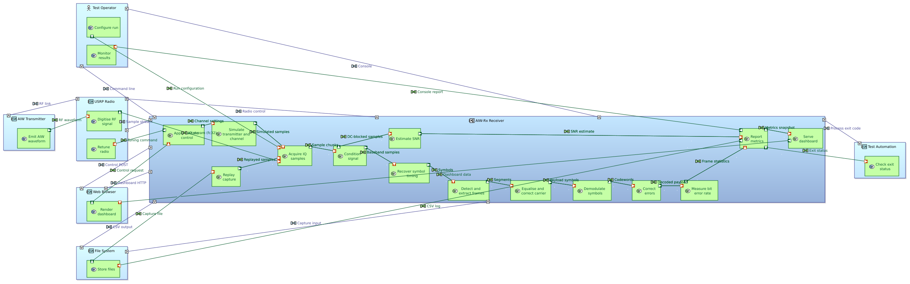
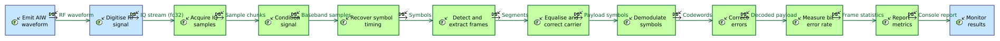
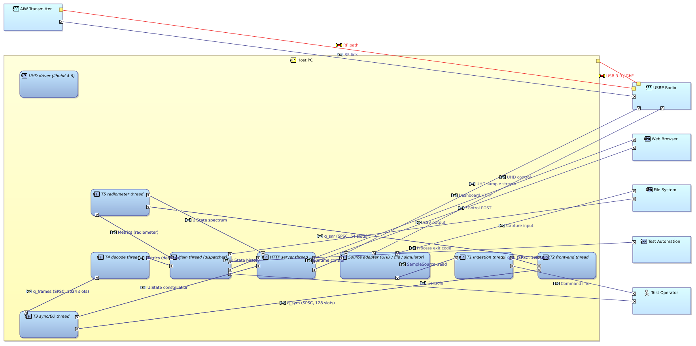

# AIW-Rx: Capella MBSE model

An [Eclipse Capella](https://eclipse.dev/capella/) model of the AIW-Rx receiver, following the
**ARCADIA** method at all five levels: Operational Analysis, System Analysis, Logical Architecture,
Physical Architecture and EPBS. Each level traces to the one above it.

| | |
| --- | --- |
| **Model** | [`AIW-Rx/`](AIW-Rx): Capella project (`AIW-Rx.capella` semantic model, `AIW-Rx.aird` diagrams) |
| **Tool** | Capella **7.0.1** (opens in any 7.0.x; newer versions migrate it automatically) |
| **Diagrams** | 16, exported as SVG and PNG in [`diagrams/`](diagrams) |
| **Validation** | Capella's full rule set: **0 errors**, 184 warnings. See [`validation/validation-results.html`](validation/validation-results.html) and the [notes](#validation) |
| **Source of truth** | The model is generated by [`generator/`](generator) running inside Capella; re-run it after changing the design |

The model describes the same design as the [Architecture document](../docs/ARCHITECTURE.md). The
document explains *why*; the model makes the structure, allocation and traceability navigable and
checkable.

---

## Opening the model

1. Install Capella 7.0.x from <https://eclipse.dev/capella/download.html>.
2. **File → Import… → General → Existing Projects into Workspace**. Select the `aiw_receiver/mbse`
   folder, tick **AIW-Rx**, then **Finish**. The project can stay where it is; it doesn't need
   copying.
3. Double-click `AIW-Rx.aird` in the Project Explorer to open the session.
4. Open diagrams from the **Activity Explorer**, or expand the model tree and look under
   **Representations per category**.

---

## Model contents

| Level | Elements |
| --- | --- |
| **Operational Analysis** | 5 entities/actors, 10 operational activities, 11 interactions, 6 communication means, 3 operational capabilities |
| **System Analysis** | System + 6 actors, 22 system functions (14 system, 8 actor), 24 functional exchanges, 10 component exchanges, 1 mission, 6 capabilities, 3 functional chains |
| **Logical Architecture** | 8 logical components + 6 actors, 30 logical functions, 34 functional exchanges, 21 component exchanges, a 6-class data model with 5 exchange items, 6 capability realizations |
| **Physical Architecture** | Host PC node, USRP and transmitter node actors, 9 behaviour components (8 threads + UHD driver) deployed on the host, 30 physical functions, 34 functional exchanges, 21 component exchanges, 2 physical links, 6 capability realizations |
| **EPBS** | 10 configuration items (CSCI, COTS, NDI, HWCI) realizing the physical components |
| **Traceability** | 83 function realizations, 65 functional-exchange and 33 component-exchange realizations, 25 component realizations, 192 port realizations, 17 capability realizations, 12 physical-artifact realizations |

### Operational Analysis: the problem

An RF test laboratory has to **evaluate the quality of the AIW 256-QAM link** in
hardware-in-the-loop tests.
- **Entities:** the *Test Engineer*, *AIW Transmitter Station*, *Radio Propagation Channel*, *Link
  Evaluation Station* and *Test Reviewer*.
- **Operational capabilities:** *Evaluate AIW link quality*, *Monitor the link in real time* and
  *Reproduce a recorded test session*.

### System Analysis: AIW-Rx as a black box

- **Actors:** Test Operator, AIW Transmitter, USRP Radio, Web Browser, File System and Test Automation.
- **Mission:** *Evaluate AIW link performance in HWIL tests*.
- **Capabilities:**
  - Receive and decode AIW frames
  - Measure link quality
  - Report results
  - Provide live dashboard and control
  - Replay recorded captures
  - Self-test with simulated transmitter
- **Functional chains:** *Live decode and measure* (RF waveform → console report), *Retune from
  dashboard* and *Replay and measure*.
- **Spec traceability:** each system function has a **Spec reference** property that points to its
  section of the AIW-Rx engineering specification (e.g. *Correct errors* → §6.2). Functions the
  specification doesn't have are marked "added".

### Logical Architecture: the pipeline

One logical component per pipeline stage:
- Sample Ingestion (T1)
- Front End (T2)
- Frame Synchroniser and Equaliser (T3)
- Decoder (T4)
- Radiometer (T5)
- Metrics Dispatcher
- Dashboard Server
- Sample Source Adapter

The **component exchanges are the real inter-thread mechanisms**: the SPSC queues `q_in`, `q_sym`,
`q_frames` and `q_snr` (with their slot counts), the atomic metrics, and the `try_lock`-only UI state.
They carry exchange items typed by the data model (`SampleChunk`, `SymbolChunk`, `Frame` ◆
`EqualizerResult`, `Metrics`, `HistoryPoint`).

### Physical Architecture: deployment

- **Where it runs:** one `aiw_rx` process on the **Host PC** node. Its eight threads and the UHD
  driver are behaviour components, deployed on the host with part-deployment links.
- **Hardware:** the **USRP** is a node actor, connected by the *USB 3.0 / GbE* physical link, which
  carries the UHD sample-stream and control exchanges. The transmitter reaches it over the *RF path*.

### EPBS: what is delivered

| Kind | Configuration items |
| --- | --- |
| **CSCI** | `aiw_rx` executable, `aiw_core` library, dashboard page, `aiw_tests` |
| **NDI** | documentation |
| **COTS** | UHD 4.6, Eigen 3.4 |
| **HWCI** | USRP B2xx, host PC |

---

## Diagrams

| Level | Diagram | Shows |
| --- | --- | --- |
| OA | [OCB Operational Capabilities](diagrams/OCB_Operational_Capabilities.png) | Capabilities and involved entities |
| OA | [OEB Operational Entities](diagrams/OEB_Operational_Entities.png) | Entities, allocated activities, interactions, communication means |
| OA | [OAIB Operational Activities](diagrams/OAIB_Operational_Activities.png) | Activity data flow |
| OA | [COC Evaluate AIW link quality](diagrams/COC_Evaluate_AIW_link_quality.png) | Contextual operational capability |
| SA | [MCB Missions and Capabilities](diagrams/MCB_Missions_and_Capabilities.png) | Mission, capabilities, actors |
| SA | [CC Receive and decode AIW frames](diagrams/CC_Receive_and_decode_AIW_frames.png) | Contextual capability |
| SA | [SDFB System Functions](diagrams/SDFB_System_Functions.png) | System function data flow |
| SA | [SAB System Context](diagrams/SAB_AIW-Rx_System_Context.png) | System, actors, allocated functions, interfaces |
| SA | [FCD Live decode and measure](diagrams/FCD_Live_decode_and_measure.png) | The nominal functional chain |
| LA | [LAB Pipeline Components and Queues](diagrams/LAB_AIW-Rx_Pipeline_Components_and_Queues.png) | Threads and SPSC queues |
| LA | [LAB Logical Architecture (with functions)](diagrams/LAB_AIW-Rx_Logical_Architecture_with_functions.png) | Full allocation view |
| LA | [LDFB Logical Functions](diagrams/LDFB_Logical_Functions.png) | Logical function data flow |
| LA | [CDB Pipeline Data Model](diagrams/CDB_Pipeline_Data_Model.png) | Classes carried by the queues |
| PA | [PAB Deployment](diagrams/PAB_AIW-Rx_Deployment.png) | Host PC with deployed threads, USRP, physical links |
| PA | [PAB Behaviour Components and Exchanges](diagrams/PAB_AIW-Rx_Behaviour_Components_and_Exchanges.png) | Threads and their exchanges |
| EPBS | [EAB Configuration Items](diagrams/EAB_AIW-Rx_Configuration_Items.png) | Delivered items and what they realize |







The diagrams were laid out by Capella's own *Arrange All*, because Capella 7.0.1 ships no ELK
layout. The large architecture diagrams are complete but not hand-tidied. In Capella, drag elements
to taste, or use *Arrange Selection* on regions.

---

## Validation

Capella's complete validation rule set (**Validate Model**) reports **0 errors** and 184 warnings.
The report is in [`validation/validation-results.html`](validation/validation-results.html). The
warnings are known and accepted:

| Warnings | Rules | Why they remain |
| --- | --- | --- |
| 78 | TC_DF_10 | "Function port shall be realized by a lower-level port". 68 are on Physical Architecture ports, the lowest functional level, so there is nothing below them. The other 10 are on OA interactions that route through the propagation channel, which has no system counterpart |
| 30 | DWF_CA_07, DCOV_08 | Capabilities have no **scenarios** yet. Sequence scenarios are the natural next modelling step |
| 24 + 9 | TJ_G_04, TJ_G_02/03 | Exchanges with no exact counterpart one level up, mostly flows through the RF channel and the internal fan-in of the three sample sources into ingestion. These are intentional refinements, not gaps |
| 19 | TC_DC_06, TC_DF_11/12 | Port-realization consistency where several lower ports refine one upper port (e.g. USRP, file and simulator inputs all refining *Acquire IQ samples*) |
| 6 | DWF_UC_02 | PA capability realizations are the lowest level, so nothing realizes them |
| 18 | TJ_SA_*, TJ_PA_09, TJ_EPBS_03, TC_DC_09 | Elements that legitimately have no counterpart: the channel and reviewer at system level; the host PC, UHD driver and physical ports at lower levels; Eigen, documentation, `aiw_core`, the page and the tests as non-physical CIs |

---

## Regenerating the model

The model, diagrams and validation report are produced by a small Eclipse plug-in
([`generator/src/aiw/capella`](generator/src/aiw/capella)) that runs **inside Capella**. It uses
Capella's own EMF factories and diagram services, so everything it produces is structurally what
Capella itself would create.

| File | Role |
| --- | --- |
| `ModelBuilder.java` | **The model content**: every element, allocation, exchange and trace, plus the list of diagrams |
| `B.java` | Helpers over Capella's factories (parts, ports, exchanges, allocations, realizations, automatic exchange tracing) |
| `Diagrams.java` | Creates the project, builds the model in one transaction, creates and populates each diagram through Capella's services, applies *Arrange All*, and saves |
| `Startup.java` | Headless entry point (`-Daiw.mode=build`) |
| `build_plugin.sh` | Compiles the plug-in against a Capella installation and installs it in `dropins/` |
| `generate.sh` | End to end: build → validate → export images → copy into this folder |

```sh
# Linux, with Capella 7.0.x, a JDK 17+ and Xvfb (xvfb-run); rsvg-convert optional (PNGs)
CAPELLA_HOME=/opt/capella/capella ./generator/generate.sh      # ~3 minutes
```

To change the design, edit `ModelBuilder.java` and re-run `generate.sh`. Element IDs are
regenerated on every run, so treat `AIW-Rx/` as build output. If you edit the model by hand in
Capella instead, stop regenerating it, or port your edits into `ModelBuilder.java`.

---

## Relation to the code

| Model element | Code |
| --- | --- |
| LA *Sample Ingestion (T1)* … *Radiometer (T5)*, *Metrics Dispatcher* | Thread lambdas and dispatcher in `src/receiver.cpp` |
| LA *Dashboard Server* | `src/http_server.cpp`, `src/dashboard.cpp`, `web/index.html` |
| LA *Sample Source Adapter* | `include/sample_source.hpp`, `include/usrp_source.hpp`, `src/tx_simulator.cpp` |
| LA component exchanges `q_in`, `q_sym`, `q_frames`, `q_snr` | `SpscRing` instances in `Receiver::run` |
| Data model classes | `SampleChunk`, `SymbolChunk`, `Frame` (`include/receiver.hpp`), `EqualizerResult` (`include/equalizer.hpp`), `Metrics` (`include/metrics.hpp`), `HistoryPoint` (`include/ui_state.hpp`) |
| SA functions' *Spec reference* | Sections of the AIW-Rx engineering specification |
